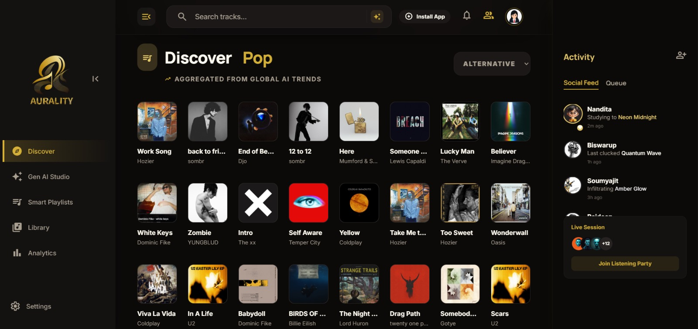

# AURALITY — The Vibe Coded Music Experience 🎶

> **"Coding is no longer about writing lines; it's about orchestrating intent."**

Auraity is a premium, high-performance music streaming ecosystem designed for the next generation of listeners. This project serves as a cornerstone demonstration of **Vibe Coding**—where human creativity meets the combined intelligence of the world's most advanced AI models.

---

## ✨ The Vibe Coding Workflow

This entire platform was conceptualized, engineered, and polished using a multi-agent orchestrated workflow:

*   🧠 **Gemini (The Architect)**: Managed the global application architecture, Redux state orchestration, and complex API integration logic.
*   🧵 **Stitch (The Designer)**: Enforced a rigid, premium design system across all components, ensuring consistent glassmorphic aesthetics and typography.
*   🎭 **Claude (The Polisher)**: Executed high-fidelity UI refinements, solved complex responsive layout collisions, and optimized smooth-as-butter animations.

---

## 🚀 Experience the Pulse

- **Live URL**: [Explore Aurality]((https://auralitymusicstreaming.vercel.app/))

---

## 💎 Key Features

- **Sonic Canvas AI Studio**: Generative AI interface that allows users to prompt their own musical future.
- **Quantum Social Feed**: Real-time activity tracking for friends (featuring Srikant, Arnab, and more).
- **Responsive Z-Index Sandwich**: A rock-solid, mobile-first header architecture that never clips or overlaps.
- **Glassmorphic UI**: Ultra-modern, frosted-glass design language with vibrant aurora backgrounds.
- **Smart Queue Management**: Redux-powered playback control with seamless track transitions.

---

## 🛠️ Tech Stack

- **Core**: React.js / Vite
- **State**: Redux Toolkit (Slices & API Services)
- **Styling**: Tailwind CSS (Custom Golden Cozy Palette)
- **Motion**: Framer Motion (Glass/Slide Transitions)
- **API**: Spotify-grade data via RapidAPI

---

## 📸 Preview



---

## 💻 Self-Hosting / Local Development

1. **Clone & Install**:
   ```bash
   git clone https://github.com/Prodipsen27/auralitymusicstreaming.git
   cd auralitymusicstreaming
   npm install
   ```

2. **Environment Setup**:
   Create a `.env` file and add your `VITE_GEO_API_KEY` and `VITE_SHAZAM_CORE_RAPID_API_KEY`.

3. **Run Dev**:
   ```bash
   npm run dev
   ```

---

*“Built with vibes, fueled by silicon.”* — **Aurality v1.0**
